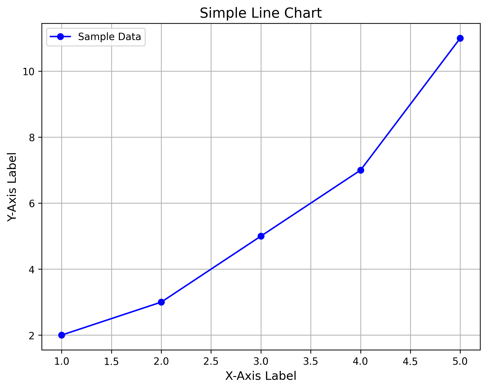
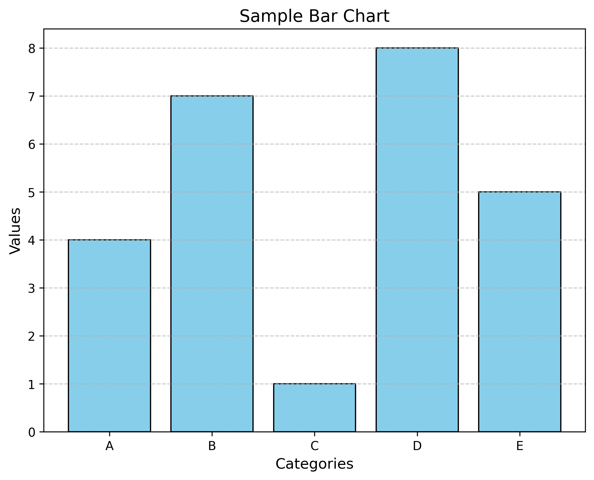
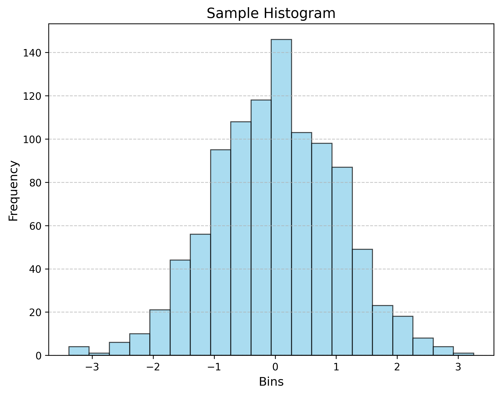
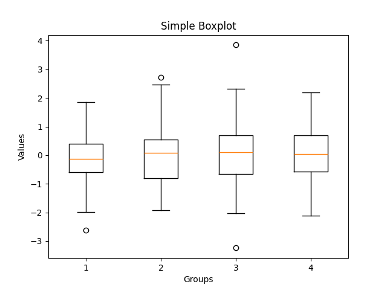

# Creating graphs in ggplot, matplotlib and seaborn

## Scatterplot

## Line chart

### Matplotlib

```
import matplotlib.pyplot as plt

# Sample data
x = [1, 2, 3, 4, 5]
y = [2, 3, 5, 7, 11]

# Create the plot
plt.figure(figsize=(8, 6))  # Set the figure size
plt.plot(x, y, marker='o', linestyle='-', color='b', label='Sample Data')  # Line with markers

# Add title and labels
plt.title('Simple Line Chart', fontsize=14)
plt.xlabel('X-Axis Label', fontsize=12)
plt.ylabel('Y-Axis Label', fontsize=12)

# Add grid and legend
plt.grid(True)
plt.legend()

# Show the plot
plt.show()
```




## Bar chart

```
import matplotlib.pyplot as plt

# Sample data
categories = ['A', 'B', 'C', 'D', 'E']
values = [4, 7, 1, 8, 5]

# Create the bar chart
plt.figure(figsize=(8, 6))  # Set the figure size
plt.bar(categories, values, color='skyblue', edgecolor='black')  # Create bars

# Add title and labels
plt.title('Sample Bar Chart', fontsize=14)
plt.xlabel('Categories', fontsize=12)
plt.ylabel('Values', fontsize=12)

# Add grid
plt.grid(axis='y', linestyle='--', alpha=0.7)

# Show the chart
plt.show()
```



## Histogram

```
import matplotlib.pyplot as plt
import numpy as np

# Sample data
data = np.random.randn(1000)  # 1000 random numbers from a normal distribution

# Create the histogram
plt.figure(figsize=(8, 6))  # Set the figure size
plt.hist(data, bins=20, color='skyblue', edgecolor='black', alpha=0.7)

# Add title and labels
plt.title('Sample Histogram', fontsize=14)
plt.xlabel('Bins', fontsize=12)
plt.ylabel('Frequency', fontsize=12)

# Add grid
plt.grid(axis='y', linestyle='--', alpha=0.7)

# Show the chart
plt.show()
```



## Pie chart

## Boxplot

```
import matplotlib.pyplot as plt
import numpy as np

# Sample data
np.random.seed(42)  # For reproducibility
data = [np.random.randn(100) for _ in range(4)]  # 4 groups of random data

# Create the boxplot
plt.boxplot(data)

# Add title and labels
plt.title('Simple Boxplot')
plt.xlabel('Groups')
plt.ylabel('Values')

# Show the plot
plt.show()
```



## Maps?
